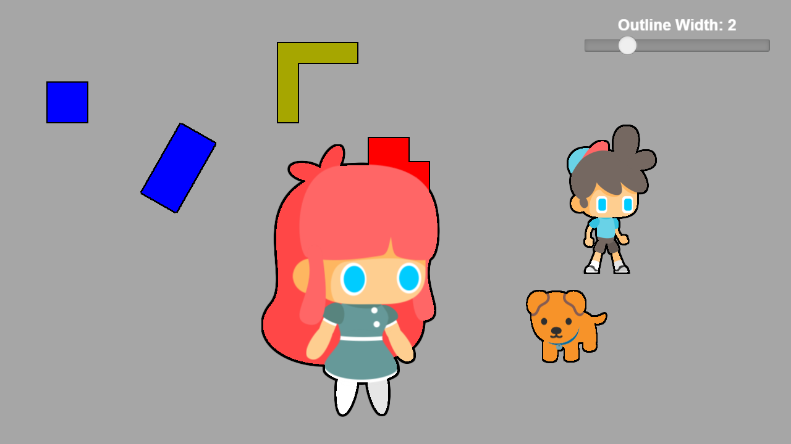

# Cocos Creator 3.8 Outline Postprocess Effect

This is a postprocess effect for Cocos Creator 3.8 that draws an outline around 2d sprites.
Camera that contains this effect is set to only render nodes with the "Outline" tag.

## Without outline

## With outline

## ToDo

- [ ] Add antialiasing support
- [ ] Add 3D support